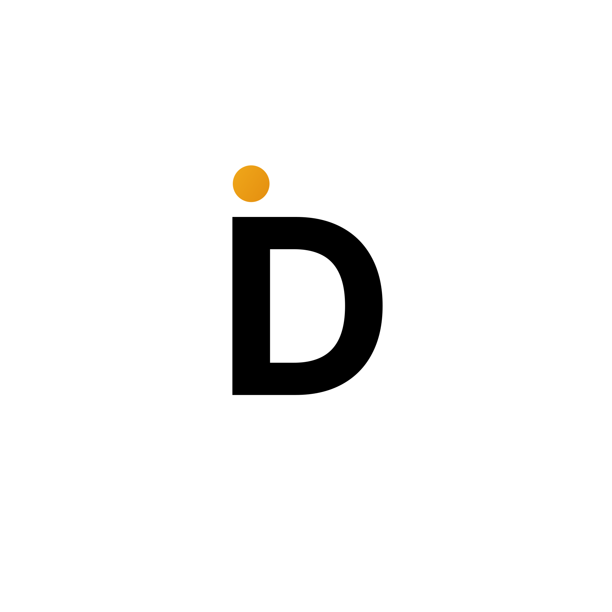

<p align="center">
  <picture>
    <source media="(prefers-color-scheme: dark)" srcset="./public/dark-logo.svg" />
    
  </picture>
</p>

<h1 align="center">Find Developer</h1>

<p align="center">
  <strong>Portfolios, hackathons, and teams—one place to showcase talent and run events.</strong>
</p>

<p align="center">
  <a href="https://laravel.com"></a>
  <a href="https://vuejs.org"></a>
  <a href="https://inertiajs.com"></a>
  <a href="https://pestphp.com"></a>
  
</p>

---

## What this is

**Find Developer** is a full-stack platform for **developer portfolio management** and **hackathon coordination**. Teams can discover profiles, explore skills and projects, join events, vote, earn badges, and stay in the loop with newsletters—while admins orchestrate everything behind a role-aware dashboard.

Built for clarity and momentum: modern stack, typed frontend, and tests that keep shipping safe.

---

## Highlights

| Area | What you get |
|------|----------------|
| **Profiles** | Developer pages with skills, experience, projects, and blogs |
| **Events** | Hackathons with teams, voting, and structured participation |
| **Recognition** | Badges and achievements that tell a story |
| **Access control** | Roles: Super Admin, Admin, HR, Developer (Fortify + Spatie Permission) |
| **Newsletter** | Built-in subscriber flows for updates |

---

## Tech stack

- **Backend:** PHP 8.4, Laravel 12, Inertia.js v2  
- **Frontend:** Vue 3, TypeScript, Vite 7, Tailwind CSS 4  
- **Auth:** Laravel Fortify, Spatie Laravel Permission  
- **Testing:** Pest 4 (feature, unit, and browser-ready)  
- **Database:** SQLite by default; MySQL supported  

---

## Requirements

- PHP **8.4**+ and [Composer](https://getcomposer.org)  
- [Node.js](https://nodejs.org) (LTS recommended) and npm  
- Extensions and tooling typical for Laravel (e.g. `pdo`, `mbstring`, `openssl`)

---

## Quick start

From the project root:

```bash
composer run setup
```

This installs PHP and JS dependencies, prepares `.env`, generates the app key, runs migrations, and builds frontend assets.

Start the full local stack (API server, queue, logs, Vite):

```bash
composer run dev
```

Or run only the Vite dev server:

```bash
npm run dev
```

Production builds:

```bash
npm run build
npm run build:ssr   # with SSR
```

---

## Testing and code quality

```bash
php artisan test
php artisan test --filter=YourTestName

vendor/bin/pint --dirty
npm run lint
npm run format
```

---

## Project layout (short)

| Path | Role |
|------|------|
| `app/Http/Controllers/` | Dashboard, API, settings, and public controllers |
| `app/Models/` | Eloquent models and domain logic |
| `resources/js/pages/` | Inertia page components |
| `routes/web.php` | Web routes (public + dashboard) |
| `routes/api.php` | JSON API endpoints |

More detail: see [`CLAUDE.md`](./CLAUDE.md) for architecture and conventions.

---

## License

This project is licensed under the **MIT** license (see `composer.json`).
